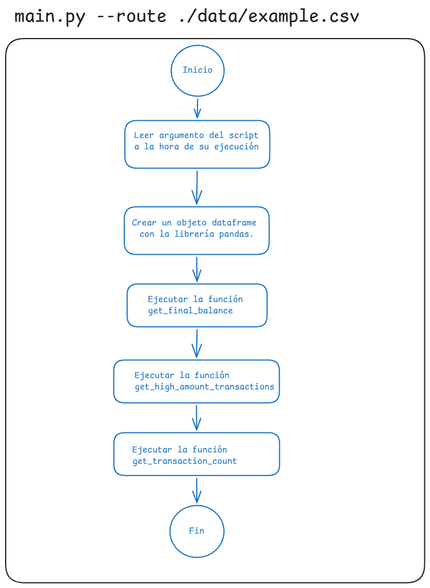

# Introducción
Reto técnico que consiste en crear una aplicación que procese un archivo CSV y genere un reporte de transacciones, con el propósito de aplicar y demostrar los conocimientos en algoritmos, programación orientada a objetos (POO) y mejores prácticas de programación.

# Instrucciones de Ejecución
Antes de ejecutar el programa debemos asegurarnos que tengamos instalado Python en nuestro sistema. Si no lo tenemos instalado, puedes descargarlo desde la página oficial de Python: <https://www.python.org/downloads/>. 

Para ejecutar el programa, sigue los siguientes pasos:
1. Abra una terminal o línea de comandos en tu sistema operativo.
2. Crear un entorno de python virtual con el siguiente comando:
```
python -m venv venv
```
3. Activar el entorno de python virtual con el siguiente comando:
```
.\venv\Scripts\activate
```
4. Instalar las dependencias necesarias con el siguiente comando:
```
pip install -r requirements.txt
```
5. Ejecutar el programa con el siguiente comando:
```
python main.py --route ./data/example.csv
```

# Enfoque y Solución
Durante el análisis de este reto técnico se identificó que uno de los aspectos más importante es como trataremos el archivo CSV. Para ello, se utilizó la librería Pandas, que es una librería de Python muy popular para manipular y analizar datos en formato CSV.


### Algoritmo


# Estructura del Proyecto

### Archivo main.py
Este archivo contiene la lógica principal del programa, incluyendo la creación de la clase Reporte y la ejecución del programa.

### Carpeta data
Contiene un archivo CSV de ejemplo que se utilizará para el análisis del reto técnico.

### Archivo requirements.txt
Contiene las dependencias necesarias para ejecutar el programa.
